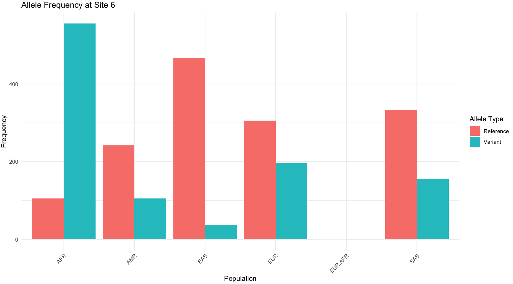

# Task9 - Analysis of human SNP variation from 1000 genomes data

In this lab, you will be analyzing available data from the 1000 genomes project - https://en.wikipedia.org/wiki/1000_Genomes_Project

You will 

### Requirements

#### Command-line tools
* Access to a linux-based OS running BASH
* Tabix
* vcftools
* R


# Linux command-line

## Getting Started

* Login to your linux environment and create a new folder for your task7

```
mkdir task9  #creates folder
cd task9 #enters into folder
```

## Download the VCF file for your chromosome of interest

e.g., below we will download chromosome 12

```
wget ftp://ftp.1000genomes.ebi.ac.uk//vol1/ftp/release/20130502/ALL.chr12.phase3_shapeit2_mvncall_integrated_v5b.20130502.genotypes.vcf.gz

wget ftp://ftp.1000genomes.ebi.ac.uk//vol1/ftp/release/20130502/ALL.chr12.phase3_shapeit2_mvncall_integrated_v5b.20130502.genotypes.vcf.gz.tbi
```

## Download the reference genome (optional, if needed)
```
wget http://ftp.1000genomes.ebi.ac.uk/vol1/ftp/technical/reference/human_g1k_v37.fasta.gz

gunzip human_g1k_v37.fasta.gz

wget http://ftp.1000genomes.ebi.ac.uk/vol1/ftp/technical/reference/human_g1k_v37.fasta.fai
```


## Use `tabix` to extract the region of interest from the chromosome 

e.g., suppose we are interested in the variants found across the 1000-bp region 49687909-49688909 of chromosome 12

```
tabix -fh ALL.chr12.phase3_shapeit2_mvncall_integrated_v5b.20130502.genotypes.vcf.gz 12:49687909-49688909 > region.vcf
```

## convert VCF file to tab-separated file
```
cat region.vcf | vcf-to-tab > region.tab
```

* How many SNPs were detected?

## More links

* https://vcftools.github.io/perl_examples.html


# Data analysis in R

## Loading the region.tab data and visualization as a heatmap

```
# Load required library
if (!require("pheatmap")) {
  install.packages("pheatmap")
  library(pheatmap)
}

# Read the header line separately to get the sample names without modification
header_line <- readLines("region.tab", n = 1)
header_parts <- unlist(strsplit(header_line, "\t"))

# Extract the sample names (from the 4th column onward)
sample_names <- header_parts[4:length(header_parts)]

# Load the rest of the data
data <- read.table("region.tab", header = TRUE, sep = "\t", stringsAsFactors = FALSE, check.names = FALSE, comment.char = "#")


#Load the metadata

metadata <- read.delim("igsr_samples.tsv",sep='\t',header=T)

# Define the most common allele for each position and use it as the reference
presence_absence_matrix <- apply(data[, 4:ncol(data)], 1, function(genotypes) {
  # Calculate the most common allele
  most_common_allele <- names(sort(table(genotypes), decreasing = TRUE))[1]
  # Mark as 1 if different from the most common allele, else 0
  ifelse(genotypes == most_common_allele, 0, 1)
})

# Transpose the matrix to have samples as columns
presence_absence_matrix <- t(presence_absence_matrix)

# Set row and column names for clarity
rownames(presence_absence_matrix) <- paste(data$CHROM, data$POS, sep = ":")
colnames(presence_absence_matrix) <- sample_names

# Filter out rows with no variation (all 0s) and rows with all 1s
presence_absence_matrix_filtered <- presence_absence_matrix[rowSums(presence_absence_matrix) > 0 & rowSums(presence_absence_matrix) < ncol(presence_absence_matrix), ]

pop <- metadata[match(sample_names,metadata[,1]),6]


# Create a data frame for annotation
annotation_df <- data.frame(Population = pop)
rownames(annotation_df) <- sample_names


# Plot heatmap with annotation
pheatmap(
  t(presence_absence_matrix_filtered),
  color = colorRampPalette(c("white", "blue"))(100), # Use a gradient
  main = "Presence-Absence Heatmap for Variant Sites",
  cluster_rows = TRUE,
  cluster_cols = FALSE,
  display_numbers = FALSE,
  fontsize_row = 1,
  fontsize_col = 6,
  annotation_row = annotation_df
)


```


## Plotting the frequencies of specific SNPs per population

```
# Define the site of interest
site <- 6

# Get indices for samples with reference and variant alleles
withRefBase <- which(presence_absence_matrix_filtered[site, ] == 0)
withVariant <- which(presence_absence_matrix_filtered[site, ] == 1)

# Get population labels for each sample
populations <- pop

# Count the number of reference and variant alleles in each population
ref_counts <- table(populations[withRefBase])
variant_counts <- table(populations[withVariant])

# Combine the counts into a data frame for plotting
allele_counts <- data.frame(
  Population = unique(populations),
  Reference = sapply(unique(populations), function(p) ref_counts[p]),
  Variant = sapply(unique(populations), function(p) variant_counts[p])
)

# Replace NA with 0 where counts are missing
allele_counts[is.na(allele_counts)] <- 0

# Reshape the data for plotting with ggplot2
library(reshape2)
allele_counts_long <- melt(allele_counts, id.vars = "Population", variable.name = "Allele", value.name = "Count")

# Plot the frequencies
library(ggplot2)
ggplot(allele_counts_long, aes(x = Population, y = Count, fill = Allele)) +
  geom_bar(stat = "identity", position = "dodge") +
  labs(title = paste("Allele Frequency at Site", site),
       x = "Population",
       y = "Frequency",
       fill = "Allele Type") +
  theme_minimal() +
  theme(axis.text.x = element_text(angle = 45, hjust = 1))
```



